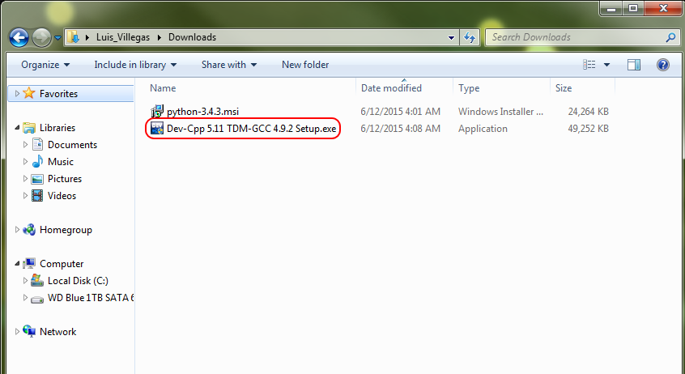
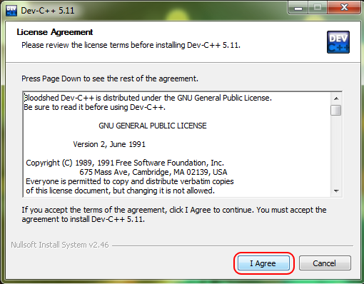

:Camp: Intro to C++
:Instructor: Luis Villegas

Introduction
============

This page is intended to provide assistance in the installatino and set up of the C++ compiler that will be used in the camp. For Windows matchies, **Orwell Dev C++** is used, and for Mac, **XCode**.

Download (Windows)
=================

For Windows matchines, **Orwell Dev C++** can be dowloaded from the following link:
- http://download.cnet.com/Orwell-Dev-C/3001-2069_4-12686.html?hlndr=1
Download should commence emediately.

For Mac matchines, the **XCode** can be downloaded from the app store. The app is called **XCode**, and the app is free to download.

Installation
============

The following demonstarates the installatino of the compiler for Windows and Mac.

Windows Machine
+++++++++++++++

To begin installation of **Dev C++** , locate where the download was saved and run the executable called "Dev-Cpp 5.11 TDM-GCC 4.9.2 Setup.exe". By default the file should be located in the *Downloads* directory.

Next, run the exacutable and you will see the follwing window:

