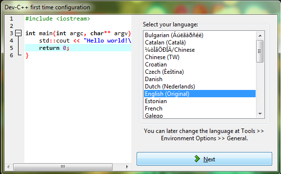

:Camp: Intro to C++
:Instructor: Luis Villegas

Introduction
============

This page is intended to provide assistance in the installatino and set up of the C++ compiler that will be used in the camp. For Windows matchies, **Orwell Dev C++** is used, and for Mac, **XCode**.

Download (Windows)
=================

For Windows matchines, **Orwell Dev C++** can be dowloaded from the following link:

- http://download.cnet.com/Orwell-Dev-C/3001-2069_4-12686.html?hlndr=1

Download should commence emediately.

For Mac matchines, the **XCode** can be downloaded from the app store. The app is called **XCode**, and the app is free to download.

Installation
============

The following demonstarates the installatino of the compiler for Windows and Mac.

Windows Machine
+++++++++++++++

To begin installation of **Dev C++** , locate where the download was saved and run the executable called "Dev-Cpp 5.11 TDM-GCC 4.9.2 Setup.exe". By default the file should be located in the *Downloads* directory.

..  image:: images/Image_1.png
    :align: center

Next, run the exacutable and you will see the follwing window:
Here you will read over the license agreement and agree if you choose to. Click **Agree**.

Once you agree, you will be prompted to select with features you would like to install. For class purposes, it is recomended to use the default features selected. Click **Next**.

Now you will chose where the program should be saved. Click **Browse** if you would like to choose a diferent locatino than the default location.

After selecting the program location, click **Install**.

The installation will take place.

Once the installation is complete, you are given the option to run **Dev C++**. By default this optino is checked. If you do not wish to run **Dev C++** at moment, uncheck the box. Then click **Finish**.

Compiler Configuration Setup
----------------------------

If you chose to run **Dev C++** after the installatino wasw completed, you will be prompted to choose the setting for the complier. The follwing window will appear:

You will pe prompted to pick the language that you would like to compiler to be in. (Note: This will only change the menu language. All code will still me writen in English). After selecting you language, click **Next**.

Next you will be asked to select the compiler color scheme and icon images. Click **Next** once you have chosen the color and icons.

Lastly, click **OK** to finish the configuration.

You are all done. Orwell Dev C++ is now installed on you matchine and you can begin your journey into programing with C++.

