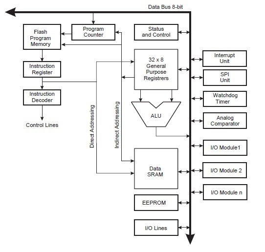
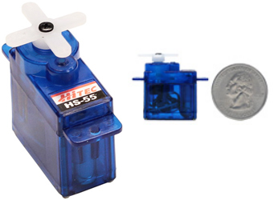
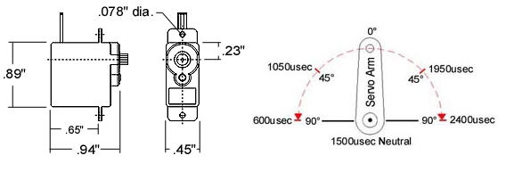
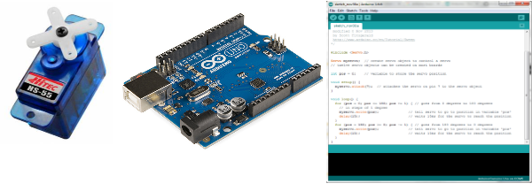

:Team: Foxtrot
:Members: Luis Villegas, Woong Hong, Cesar Garza
:Project: Group Project 2

Introduction
============

This project is to be completed with a functioning servo motor that will properly rotate in any desired positions through the use of an Arduino Uno Microcontroller. We will control the delays between each rotation, and interrupts will be implemented in our code. All the coding will be done in assembly language.

Microcontroller  Architecture
=============================

Arduino is an open source micro controller invented in year 2005 by Hernando Barragan, a Colombian student at Ivrea Interaction Design Institute, located in Italy. Its' uses and adaptations are applicable to almost anything in our real world environment. There are many popular Arduino projects in trend, such as heart rate monitors, drones, 3D printers, buzzer buttons, and email alerts on phone. The hardware is often used to collect data for scientific research and development.

To assist the Arduino Uno in performing its commands, it has mounted on a ATmega328P microcontroller. The ATmega328P is a low-power 8-bit microcontroller which is based on the AVR enhanced reduced instruction set computing (RISC) architecture. This means that it uses a small, highly optimized set of instructions, rather than a more versatile set of instructions like in complex instruction set computing (CISC). This allows the ATmega328P to execute powerful instructions in a single clock cycle, and achieves throughputs approaching 1 MIPS per MHz . In return it allows the system designer to improve power consumption instead of processing speed.

The following block diagram is of the AVR architecture:

To make the most of performance and parallelism, the AVR integrates the Harvard architecture which means that memory is split up into two parts, data and code. This means that each has its own area in memory and has its own buses to be moved around with. For code the ATmega328P contains 32K bytes of On-chip In-System Reprogrammable Flash memory for program storage. Since the AVR instructions are either 16 or 32 bits wide, the flash memory is organized as 16K x 16 to better optimize space. The ATmega328P is also equipped with 32 x 8-bit general purpose fast-access register files. Six of these 32 registers can be used as three 16-bit indirect address register pointers for Data Space addressing, which allows for efficient address calculations. One of these address pointers can also be used as an address pointer for look up tables in Flash memory.

All the ATmega328P ports have true Read-Modify-Write functionality when used as general digital I/O ports. What this means is that the direction of one port pin can be altered without unintentionally changing the direction of any other pin with the SBI, set a bit, and CBI, clear a bit, instructions. This means that using the IDE, you can designate what a pin will be used for, either for input or output, by using the specific commands available. The same applies when changing drive value (if configured as output) or enabling/disabling of pull-up resistors (if configured as input). Each output buffer has symmetrical drive characteristics with both high sink and source capability. The pin driver is strong enough to drive LED displays directly. All port pins have individually selectable pull-up resistors with a supply-voltage invariant resistance.

The ALU on the ATmega328P handles the Arduino Uno's arithmetic and logic operations. The ALU is capable of handling these operations by using two operands from registers or from a constant and a register. Single register operations can also be performed with the ALU. Once an arithmetic operation is performed, the Status Register is updated to reflect information about the result of the operation. The ALU operates in direct connection with all the 32 general purpose working registers. Operations, between general purpose registers or between a register and a literal, a typically performed within a single clock cycle. The ATmega328P's ALU operations are divided into three main categories - arithmetic, logical, and bit-functions. Some implementations of the architecture also provide a powerful multiplier supporting both signed/unsigned multiplication and fractional format.

Instructions in the ATmega328P are executed with a single level pipelining. What this means is that while one instruction is being executed, the next instruction is being pre-fetched from the program memory to be moved in right after the current instruction passes the first stage. This also means that a code block is broken up into simpler blocks and allowing instructions to be executed in every clock cycle. All the instructions are controlled by the ATmega328P's clock. The clock is what initiates the cycle of instructions executed and how fast they are done. With the single level pipelining, an ALU operation can be performed in one clock cycle.

The Test Device
===============

For our project we decided to control a Micro Servo with the Arduino Uno. The specific servo that we used is a "HiTec HS-55 Micro Servo". The HS-55 is a common servo that is popular among tech hobbyists. The HS-55 measures 0.89 x 0.45 x 0.94 (inch), weighs 0.28 ounces,  has a torque of about 16 (oz/in), and can reach a speed of .15 sec @ 60 degrees. 

Development Tools
=================

The tools required for this experiment were the installation for the latest Arduino IDE (v1.6.6), a Micro Servo, and a Arduino Uno Microcontroller. Also, Arduino IDE must be set to the matching port of our hardware setup.

Hardware Functionality
======================

The first step we took was to make sure that the hardware was functional, and get an idea of what is needed to get the servo to sweep. To do this, we decided to develop some code using the Arduino IDE v1.6.6. We identified that we needed to include an additional library that enabled the creation of a servo object, and the use of functions that would set the position of the servo. This meant that there must be more going on in the background other then turning on the servo and turning it off. Initially we created a servo object and set the staring position to 0. We then coded an infinite loop so that we have the servo motor rotate half way with wait time intervals between every assigned degree, then rotate half way in reverse with the same wait time process. Our tested loop coding is as follows, initiate a variable "position" of 0 and condition for loop, position is less than or equal to 180 while position is incremented by 1 on each loop. Every loop has a built-in function with position variable sent as an argument, and called to have the servo rotate to that position. Then, built-in delay function is called to waste time for 15 milliseconds. Once the loop is completed, servo is now positioned 180 degrees from its original position and carries on the next similar loop, except that its rotation is reversed such that position is initiated to 180 and conditioned position greater than or equal to 0, while position is decremented on each loop.

The hardware set up is presented in the following diagram:

..  image:: servo_setup.png
    :align: center

Pulse-with-Modulation
=====================

The next step involved researching how the servo works using assembly code. We found that the servo requires Pulse-With-Modulation. PWM is the use of pulsing a signal to the servo on and off at some frequency. This means that within a specific time period the servo should be switched on/off for X amount of time. The code to get the servo to work in theory requires the use of a timer to generate the interrupt like in our previous projects. The only difference is that PWM also requires a second timer to be used to switch the signal on or off. This requires the use of a comparator, which is a register that holds information which can be used to compare the current count of the timer and data in the comparator register. If the timer count is below the value of the comparator, then the signal will be off, if the reverse occurs (time counter is higher than comparator), then the signal will be on. The setting of the comparator is what determines the amount of time the signal will be off or on. The first counter is used to set up the interrupt intervals.  The second counter along with the comparator, is used to set the interval off the amount of time the signal is on or off before an interrupt occurs. A typical servo requires a minimum of 1ms on and 2ms off in a time period of 20ms (50Hz).

Next we developed assembly code (based on the kernel lab) applying pulse-with-modulation to test the servo with assembly code to practice the concept. We got the servo to rotate by making some adjustments to the code and the amount of time it is on and off within the time interval. We managed to get the servo to rotate in one 180 degrees direction 180, but then it locked up. We came across the same issue when we developed code using the Arduino IDE. We noted that the servo only rotates 180 degrees in either direction before locking up. If we tried to go past 180 degrees the servo would lock up. We also learned that changing the clock speed permits changing the speed of the rotation of the servo. The next step is to make the servo rotate 180 degrees and then spin in the opposite direction 180 degrees, and then repeat the process. By applying the concept of decreasing the brightness of the LED found in the PWM lecture notes, we believe we can get the servo to rotate in the opposite direction. 

Conclusion
==========

After attempting to get the servo to function properly, we have come to understand that in order to interact properly with hardware, through the use of a microcontroller, the timing between the two devices is crucial. As opposed to the Intel chip, which was all about speed, the microcontroller is all about precision. Certain sequences need to be performed within a specific time interval or else the device will not function properly. So, the use of time wasting loops came in handy for this specific situation. This led up to understand the importance of understanding the difference between the two types chips and their application in our day to day lives. Micro-controllers are becoming very popular, with the movement towards mobile devices, and is crucial to understand how they communicate with other hardware, giving us a better chance in the work field.

Contributors
============

Group Foxtrot spent most of our time in group during lab period because our group have done the experiments with the hardware and coding of assembly language on Luis' personal laptop. Luis had setup the software and prepared the files and codes required for the project  while Cesar put together a functioning hardware and device. Woong assisted in finding solutions to the errors of the codes. For each of our contributions on report, Woong had written the overview of our project while Luis organized the parts of report outline. Cesar corrected grammatical errors and edited to simplify and delete any unnecessary wordings.

Reference
=========

*	Reason for use - http://www.electricaltechnology.org/2014/11/arduino-programming-how-to-programe-arduino.html
*	Example Projects - http://arduinoarts.com/what-is-arduino/
*	History of Arduino - http://www.circuitstoday.com/story-and-history-of-development-of-arduino
*	What is Arduino - https://www.arduino.cc/en/Guide/Introduction
*	Processor Architecture - http://www.atmel.com/Images/doc8161.pdf
*	Servo Specs - https://www.servocity.com/html/hs-55_sub-micro.html#.VmeX77grLcd
*	Servo Setup - https://www.arduino.cc/en/Tutorial/Sweep
